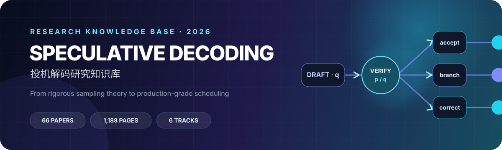

<div align="center">
  
  <h1>Speculative Decoding 研究知识库</h1>
  <p>把论文森林变成一张可比较、可复现、可以直接选题的研究地图。</p>
  <p>
    <a href="https://edgeai1.github.io/speculative-decoding-knowledge-base/"></a>
    <a href="https://edgeai1.github.io/speculative-decoding-knowledge-base/AUDIT_REPORT/"></a>
    <a href="https://edgeai1.github.io/speculative-decoding-knowledge-base/papers/03-feature-mtp-parallel-block/2026--dspark/"></a>
  </p>
  <p><b>66 篇核心精读</b> · <b>1,188 页全文核读</b> · <b>6 条研究主线</b> · <b>截至 2026-08-10</b></p>
</div>

---

> [!NOTE]
> 本库覆盖 2018–2026 年 8 月的 66 篇核心论文。每个条目均记录已读版本、页码范围与 PDF SHA-256；原始 PDF 因版权不进入仓库。

这个知识库面向准备进入 speculative decoding 研究的读者。目标不是复述摘要，而是把每篇论文的问题、假设、算法、公式、训练与推理流程、正确性边界、实验、实现路径、复现风险、局限和可继续研究的问题压缩进一个可独立阅读的中文文件。

<p align="center"><a href="https://edgeai1.github.io/speculative-decoding-knowledge-base/"><b>打开可搜索文档站 →</b></a></p>

## 从哪里开始

- 第一次进入方向：先看 [方法谱系与分类](TAXONOMY.md)，再读基础类别中的两篇 2023 年 speculative sampling 奠基论文。
- 准备做算法：看 [跨论文比较与研究问题](COMPARISON.md) 和 [研究空白 shortlist](landscape/research-gaps-shortlist.md)。
- 准备做系统：重点读第 05/06 类、DSpark、DFlash、SPEED-Bench 和 *Performance or Illusion?*。
- 核对 lossless/lossy：先看 [术语与正确性边界](GLOSSARY.md)，再看 Block Verification、MARS、Revisiting Lossy Verification 与 ASD。
- 查更宽文献：看 [截至 2026-08-10 的完整方向综述](landscape/complete-survey-2026-08-10.md)；[1260 条高召回候选表](metadata/literature_candidates.csv) 仅是检索候选，不等于 1260 篇核心论文或已完成精读。

## 阅读状态与证据边界

本 README 只列出 `deep_read_complete` 条目。原始 PDF 与抽取文本用于本地核读，因版权不进入仓库；公开文件保留官方入口、版本、页码和哈希。速度数字均按原论文硬件、batch、temperature、backend和baseline解释，不把最高 endpoint 当作普遍结论。详见 [调研与精读方法](METHODOLOGY.md) 和 [来源清单](SOURCES.md)。

## 核心论文目录

### 01 基础、理论与综述（9 篇）

[查看本类导读与推荐阅读路线](collections/01-foundations.md)

| 年份 | 论文 | Venue |
|---:|---|---|
| 2018 | [Blockwise Parallel Decoding for Deep Autoregressive Models](papers/01-foundations-theory-surveys/2018--blockwise-parallel-decoding-2018.md) | NeurIPS 2018 |
| 2022 | [Speculative Decoding: Exploiting Speculative Execution for Accelerating Seq2seq Generation](papers/01-foundations-theory-surveys/2022--speculative-decoding-for-seq2seq-2022.md) | arXiv / ICLR 2023 submission |
| 2023 | [Accelerating Large Language Model Decoding with Speculative Sampling](papers/01-foundations-theory-surveys/2023--accelerating-llm-decoding-with-speculative-sampling-2023.md) | arXiv technical report |
| 2023 | [Fast Inference from Transformers via Speculative Decoding](papers/01-foundations-theory-surveys/2023--fast-inference-from-transformers-via-speculative-decoding-icml-2023.md) | ICML 2023 |
| 2023 | [SpecTr: Fast Speculative Decoding via Optimal Transport](papers/01-foundations-theory-surveys/2023--spectr-optimal-transport-verification-2023.md) | NeurIPS 2023 |
| 2024 | [Unlocking Efficiency in Large Language Model Inference: A Comprehensive Survey of Speculative Decoding](papers/01-foundations-theory-surveys/2024--speculative-decoding-survey-and-spec-bench-acl-findings-2024.md) | Findings of ACL 2024 |
| 2025 | [Decoding Speculative Decoding](papers/01-foundations-theory-surveys/2025--decoding-speculative-decoding-naacl-2025.md) | NAACL 2025 |
| 2026 | [Global Resolution: Optimal Multi-Draft Speculative Sampling via Convex Minimization](papers/01-foundations-theory-surveys/2026--global-resolution-iclr-2026-oral.md) | ICLR 2026 Oral |
| 2026 | [When Is a Draft Accepted? A Theory of Acceptance in Speculative Decoding](papers/01-foundations-theory-surveys/2026--when-is-a-draft-accepted-2026.md) | arXiv preprint |

### 02 独立 drafter、对齐与在线选择（7 篇）

[查看本类导读与推荐阅读路线](collections/02-independent-drafters.md)

| 年份 | 论文 | Venue |
|---:|---|---|
| 2023 | [Accelerating LLM Inference with Staged Speculative Decoding](papers/02-independent-drafters-alignment-selection/2023--staged-speculative-decoding.md) | ICML 2023 workshop / arXiv |
| 2023 | [Speculative Decoding with Big Little Decoder](papers/02-independent-drafters-alignment-selection/2023--big-little-decoder.md) | NeurIPS 2023 |
| 2024 | [DistillSpec: Improving Speculative Decoding via Knowledge Distillation](papers/02-independent-drafters-alignment-selection/2023--distillspec.md) | ICLR 2024 |
| 2024 | [Online Speculative Decoding](papers/02-independent-drafters-alignment-selection/2024--online-speculative-decoding-icml-2024.md) | ICML 2024 |
| 2025 | [Learning Harmonized Representations for Speculative Sampling](papers/02-independent-drafters-alignment-selection/2025--hass-iclr-2025.md) | ICLR 2025 |
| 2026 | [Not-a-Bandit: Provably No-Regret Drafter Selection in Speculative Decoding for LLMs](papers/02-independent-drafters-alignment-selection/2026--not-a-bandit-iclr-2026.md) | ICLR 2026 |
| 2026 | [Speculative Decoding and the Curse of Multilinguality](papers/02-independent-drafters-alignment-selection/2026--curse-of-multilinguality.md) | arXiv preprint |

### 03 Feature head、MTP 与并行块草稿（20 篇）

[查看本类导读与推荐阅读路线](collections/03-feature-mtp.md)

| 年份 | 论文 | Venue |
|---:|---|---|
| 2024 | [EAGLE-2: Faster Inference of Language Models with Dynamic Draft Trees](papers/03-feature-mtp-parallel-block/2024--eagle-2-emnlp-2024.md) | EMNLP 2024 |
| 2024 | [EAGLE: Speculative Sampling Requires Rethinking Feature Uncertainty](papers/03-feature-mtp-parallel-block/2024--eagle-icml-2024.md) | ICML 2024 |
| 2024 | [Hydra: Sequentially-Dependent Draft Heads for Medusa Decoding](papers/03-feature-mtp-parallel-block/2024--hydra.md) | COLM 2024 |
| 2024 | [MEDUSA: Simple LLM Inference Acceleration Framework with Multiple Decoding Heads](papers/03-feature-mtp-parallel-block/2024--medusa.md) | ICML 2024 |
| 2024 | [Recurrent Drafter for Fast Speculative Decoding in Large Language Models](papers/03-feature-mtp-parallel-block/2024--redrafter.md) | arXiv preprint |
| 2025 | [EAGLE-3: Scaling up Inference Acceleration of Large Language Models via Training-Time Test](papers/03-feature-mtp-parallel-block/2025--eagle-3-neurips-2025.md) | NeurIPS 2025 |
| 2025 | [PARD: Accelerating LLM Inference with Low-Cost Parallel Draft Model Adaptation](papers/03-feature-mtp-parallel-block/2025--pard.md) | arXiv preprint |
| 2026 | [AngelSpec: Towards Real-World High Performance Inference with Speculative Decoding](papers/03-feature-mtp-parallel-block/2026--angelspec.md) | arXiv preprint |
| 2026 | [CURE: Local Uncertainty Repair for Block-Parallel Speculative Decoding](papers/03-feature-mtp-parallel-block/2026--cure.md) | arXiv preprint |
| 2026 | [DBLast: Dependent Block Drafting for Stochastic Speculative Decoding](papers/03-feature-mtp-parallel-block/2026--dblast.md) | arXiv preprint |
| 2026 | [DeLS-Spec: Decoupled Long-Short Contexts for Parallel Speculative Drafting](papers/03-feature-mtp-parallel-block/2026--dels-spec.md) | arXiv preprint |
| 2026 | [DFLARE: Scaling Up Draft Capacity for Block Diffusion Speculative Decoding](papers/03-feature-mtp-parallel-block/2026--dflare.md) | arXiv preprint |
| 2026 | [DFlash: Block Diffusion for Flash Speculative Decoding](papers/03-feature-mtp-parallel-block/2026--dflash-icml-2026.md) | ICML 2026 |
| 2026 | [Domino: Decoupling Causal Modeling from Autoregressive Drafting in Speculative Decoding](papers/03-feature-mtp-parallel-block/2026--domino.md) | arXiv preprint |
| 2026 | [DSpark: Confidence-Scheduled Speculative Decoding with Semi-Autoregressive Generation](papers/03-feature-mtp-parallel-block/2026--dspark.md) | arXiv preprint |
| 2026 | [From Chains to Trees: Parent-Conditioned Drafting for Semi-Autoregressive Speculative Decoding](papers/03-feature-mtp-parallel-block/2026--pctree.md) | arXiv preprint |
| 2026 | [JetSpec: Breaking the Scaling Ceiling of Speculative Decoding with Parallel Tree Drafting](papers/03-feature-mtp-parallel-block/2026--jetspec.md) | arXiv preprint |
| 2026 | [P-EAGLE: Parallel-Drafting EAGLE with Scalable Training](papers/03-feature-mtp-parallel-block/2026--p-eagle.md) | arXiv preprint |
| 2026 | [TreeFlash: Parallel AR-Approximation for Faster Speculative Decoding](papers/03-feature-mtp-parallel-block/2026--treeflash.md) | arXiv preprint |
| 2026 | [xPress: Parallel Refinement for Diffusion Drafters in Speculative Decoding](papers/03-feature-mtp-parallel-block/2026--xpress.md) | arXiv preprint |

### 04 Tree、多候选与 verification（9 篇）

[查看本类导读与推荐阅读路线](collections/04-tree-verification.md)

| 年份 | 论文 | Venue |
|---:|---|---|
| 2023 | [SpecInfer: Accelerating Large Language Model Serving with Tree-based Speculative Inference and Verification](papers/04-tree-multi-draft-verification/2023--specinfer.md) | ASPLOS 2024 |
| 2024 | [Multi-Candidate Speculative Decoding](papers/04-tree-multi-draft-verification/2024--multi-candidate-speculative-decoding.md) | arXiv preprint |
| 2024 | [SEQUOIA: Scalable and Robust Speculative Decoding](papers/04-tree-multi-draft-verification/2024--sequoia.md) | arXiv preprint |
| 2024 | [SpecExec: Massively Parallel Speculative Decoding for Interactive LLM Inference on Consumer Devices](papers/04-tree-multi-draft-verification/2024--specexec.md) | arXiv preprint |
| 2025 | [Block Verification Accelerates Speculative Decoding](papers/04-tree-multi-draft-verification/2025--block-verification-iclr-2025.md) | ICLR 2025 |
| 2025 | [HeteroSpec: Leveraging Contextual Heterogeneity for Efficient Speculative Decoding](papers/04-tree-multi-draft-verification/2025--heterospec.md) | arXiv preprint |
| 2026 | [Approximate Speculative Decoding](papers/04-tree-multi-draft-verification/2026--approximate-speculative-decoding.md) | arXiv preprint |
| 2026 | [MARS: Unleashing the Power of Speculative Decoding via Margin-Aware Verification](papers/04-tree-multi-draft-verification/2026--mars-margin-aware-verification.md) | arXiv preprint |
| 2026 | [Revisiting Lossy Verification in Speculative Decoding: Mechanisms, Trade-offs, and Failure Modes](papers/04-tree-multi-draft-verification/2026--revisiting-lossy-verification.md) | arXiv preprint |

### 05 Training-free、自推测与长上下文（10 篇）

[查看本类导读与推荐阅读路线](collections/05-self-spec-long-context.md)

| 年份 | 论文 | Venue |
|---:|---|---|
| 2024 | [Break the Sequential Dependency of LLM Inference Using Lookahead Decoding](papers/05-training-free-self-spec-long-context/2024--lookahead-decoding-icml-2024.md) | ICML 2024 |
| 2024 | [Draft & Verify: Lossless Large Language Model Acceleration via Self-Speculative Decoding](papers/05-training-free-self-spec-long-context/2024--draft-verify-self-speculative-decoding-acl-2024.md) | ACL 2024 |
| 2024 | [MagicDec: Breaking the Latency-Throughput Tradeoff for Long Context Generation with Speculative Decoding](papers/05-training-free-self-spec-long-context/2024--magicdec.md) | ICLR 2025 |
| 2024 | [REST: Retrieval-Based Speculative Decoding](papers/05-training-free-self-spec-long-context/2024--rest-naacl-2024.md) | NAACL 2024 |
| 2024 | [SuffixDecoding: Extreme Speculative Decoding for Emerging AI Applications](papers/05-training-free-self-spec-long-context/2024--suffixdecoding.md) | NeurIPS 2025 |
| 2024 | [TriForce: Lossless Acceleration of Long Sequence Generation with Hierarchical Speculative Decoding](papers/05-training-free-self-spec-long-context/2024--triforce.md) | COLM 2024 |
| 2025 | [LongSpec: Long-Context Lossless Speculative Decoding with Efficient Drafting and Verification](papers/05-training-free-self-spec-long-context/2025--longspec.md) | arXiv preprint |
| 2025 | [SpecExtend: A Drop-in Enhancement for Speculative Decoding of Long Sequences](papers/05-training-free-self-spec-long-context/2025--specextend.md) | arXiv preprint |
| 2026 | [Oilbird: Training-Free Speculative Decoding with Keys the Verifier Already Computes](papers/05-training-free-self-spec-long-context/2026--oilbird.md) | arXiv preprint |
| 2026 | [Windowed-MTP: Removing the Full-Context Draft-KV Tax at Million-Token Context](papers/05-training-free-self-spec-long-context/2026--windowed-mtp.md) | arXiv preprint |

### 06 Serving、基准、安全与应用（11 篇）

[查看本类导读与推荐阅读路线](collections/06-serving-security.md)

| 年份 | 论文 | Venue |
|---:|---|---|
| 2023 | [The Synergy of Speculative Decoding and Batching in Serving Large Language Models](papers/06-serving-benchmarks-security-applications/2023--synergy-of-sd-and-batching.md) | arXiv preprint |
| 2025 | [Speculative Streaming: Efficient and Scalable Speculative Decoding with Multi-Stream Attention](papers/06-serving-benchmarks-security-applications/2025--speculative-streaming-emnlp-2025.md) | EMNLP 2025 |
| 2026 | [Accelerating Large-Scale Reasoning Model Inference: Self-Speculative Decoding with Sparse Attention (SparseSpec)](papers/06-serving-benchmarks-security-applications/2026--specgen-mlsys-2026.md) | MLSys 2026 |
| 2026 | [AcceptMoE: Commitment-Weighted Self-Sizing Verifier Expert Sets for Efficient MoE Speculative Decoding](papers/06-serving-benchmarks-security-applications/2026--acceptmoe.md) | arXiv preprint |
| 2026 | [Adversarial Prompts for Acceptance Collapse in Speculative Decoding](papers/06-serving-benchmarks-security-applications/2026--adsd.md) | arXiv preprint |
| 2026 | [Lossless but Not Free: An Empirical Anatomy of Speculative Decoding on Consumer Hardware](papers/06-serving-benchmarks-security-applications/2026--lossless-but-not-free.md) | arXiv preprint |
| 2026 | [Mistletoe: Stealthy Acceleration-Collapse Attacks on Speculative Decoding](papers/06-serving-benchmarks-security-applications/2026--mistletoe.md) | arXiv preprint |
| 2026 | [PRISM: Parametrically Refactor Inference for Speculative Decoding Draft Models](papers/06-serving-benchmarks-security-applications/2026--prism-mlsys-2026.md) | MLSys 2026 |
| 2026 | [SpecRoll: Fast-Slow Verifier-Feedback Adaptation for Speculative Reinforcement Learning Rollouts](papers/06-serving-benchmarks-security-applications/2026--specroll.md) | arXiv preprint |
| 2026 | [Speculative Decoding: Performance or Illusion?](papers/06-serving-benchmarks-security-applications/2026--performance-or-illusion-mlsys-2026.md) | MLSys 2026 |
| 2026 | [SPEED-Bench: A Unified and Diverse Benchmark for Speculative Decoding](papers/06-serving-benchmarks-security-applications/2026--speed-bench-icml-2026.md) | ICML 2026 |

## 仓库结构

```text
papers/       66 篇逐篇精读，按研究问题分为 6 类
collections/  6 个专题入口与推荐阅读路线
landscape/    全方向综述、研究空白与候选问题
metadata/     核心语料元数据与高召回候选表
assets/       文档站视觉样式、图标与横幅
scripts/      语料构建、阅读证据包与质量审计脚本
```

## 维护原则

- 论文是否“无损”以输出序列/分布的数学保证为准，不以任务分数近似不变代替。
- acceptance length、wall-clock speedup、throughput 与 goodput 分开记录。
- 跨论文比较先统一硬件、engine、batch、上下文、输出长度、temperature、tree/block budget 与 baseline。
- 新论文先进入候选表，经人工相关性筛选和全文精读后才进入核心目录。
- 当前快照日期之后出现的论文不被暗示为已覆盖。
